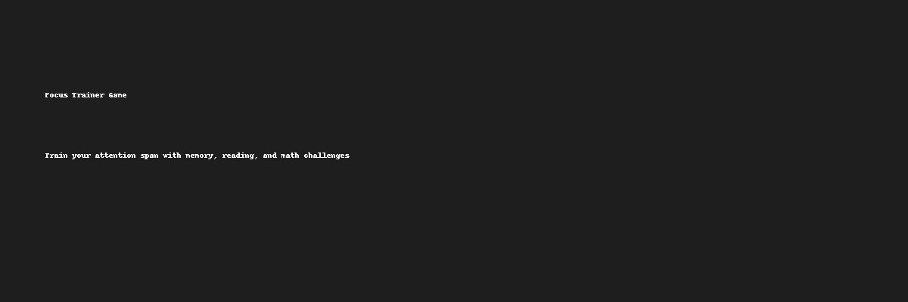

# 🎯 Focus Trainer Game

**Focus Trainer** is a web-based cognitive training game built with pure HTML, CSS, and JavaScript.  
It helps users strengthen their attention span through three interactive modes:

## 🕹️ Game Modes
- **Memory Sequence** – Repeat flashing dot sequences
- **Speed Reading** – Spot and tap the target word
- **Mental Math** – Solve timed arithmetic challenges

## 🌟 Features
- 🧠 Level-based progression
- 📈 Streak tracking and session stats
- 🌙 Toggleable Dark Mode
- 🔊 Sound feedback for actions
- 🌐 Fully browser-based (no installations required)

## 🚀 How to Use
1. Clone the repo or download `index.html`
2. Open it in any modern web browser
3. Select a mode and press Start

## 📡 Live Demo
Once deployed with GitHub Pages, your game will be live at:

```
https://yourusername.github.io/focus-trainer/
```

Replace `yourusername` with your actual GitHub username.

## 🛠️ Built With
- HTML5
- CSS3
- JavaScript

## 📄 License
This project is open-source and free to use.

---

🧩 Created with ❤️ to help you focus better, one tap at a time.
